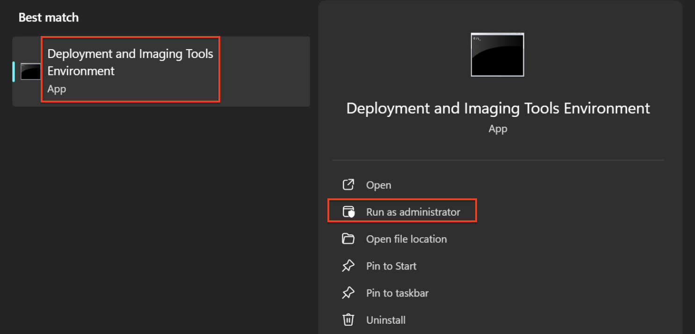

# Autounattend

Automates Windows 11 setup from boot through to OOBE. It wipes the internal disk, partitions it (EFI / MSR / Windows / Recovery), bypasses the TPM/Secure Boot/RAM checks, and installs Windows unattended.

## Prerequisites

- Disable Raid configuration in UEFI/BIOS: Boot into BIOS(F12) -> Enable Advanced setup -> Storage -> Select AHCI/NVMe
- **Windows ADK** – [https://go.microsoft.com/fwlink/?linkid=2289980](https://go.microsoft.com/fwlink/?linkid=2289980)
- **Windows PE add-on for the ADK** – [https://go.microsoft.com/fwlink/?linkid=2289980](https://go.microsoft.com/fwlink/?linkid=2289980)
- **Windows 11 ISO** (latest) – [https://www.microsoft.com/en-us/software-download/windows11](https://www.microsoft.com/en-us/software-download/windows11)
- **Bootable USB stick** created with **Rufus** - Download via MS Store

All install on default settings.

## Download these Files

- `autounattend.xml` – answer file that drives Windows Setup.
- `wipe.ps1` – runs in WinPE before the image is applied; prompts `y/n`, then wipes and partitions disk 0.

## Steps to setup USB

1. Launch **Deployment and Imaging Tools Environment as Administrator** and create the mount directory:
   

```bat
mkdir C:\mount
```

2. **Mount the boot image** to index 2 - Windows Setup(replace `<USB DRIVE LETTER>` with your USB's drive letter, e.g. `E`):

```bat
Dism /Mount-Image /ImageFile:<USB DRIVE LETTER>:\sources\boot.wim /Index:2 /MountDir:C:\mount
```

3. **Install the PowerShell modules** into the mounted image:

```bat
for %i in ("WinPE-WMI.cab" "WinPE-NetFx.cab" "WinPE-Scripting.cab" "WinPE-PowerShell.cab" "WinPE-StorageWMI.cab" "WinPE-EnhancedStorage.cab" "WinPE-FMAPI.cab" "WinPE-PmemCmdlets.cab") do Dism /Image:"C:\mount" /Add-Package /PackagePath:"C:\Program Files (x86)\Windows Kits\10\Assessment and Deployment Kit\Windows Preinstallation Environment\amd64\WinPE_OCs\%~i"
```

4. **Copy the files** using File Explorer:

- Place `wipe.ps1` inside `C:\mount\Windows\System32`.
- Place `autounattend.xml` at the root of the USB stick.

```
Structure
USB drive (E:\)
├── autounattend.xml          <- answer file at root of USB
└── sources\
    └── boot.wim              <- mounted to C:\mount (Index 2: Windows Setup)

C:\mount\                      <- mounted boot.wim contents
└── Windows\
    └── System32\
        └── wipe.ps1          <- script placed inside boot.wim
```

5. **Close all File Explorer windows** — **critical**, or the unmount in the next step will fail with errors.
6. **Save changes** by committing and unmounting the image:

```bat
Dism /Unmount-Image /MountDir:C:\mount /Commit
```

7. **Mount the boot image** to index 2 - Windows PE (Preinstallation Environment)

```bat
Dism /Mount-Image /ImageFile:<USB DRIVE LETTER>:\sources\boot.wim /Index:1 /MountDir:C:\mount
```

```bat
for %i in ("WinPE-WMI.cab" "WinPE-NetFx.cab" "WinPE-Scripting.cab" "WinPE-PowerShell.cab" "WinPE-StorageWMI.cab" "WinPE-EnhancedStorage.cab" "WinPE-FMAPI.cab" "WinPE-PmemCmdlets.cab") do Dism /Image:"C:\mount" /Add-Package /PackagePath:"C:\Program Files (x86)\Windows Kits\10\Assessment and Deployment Kit\Windows Preinstallation Environment\amd64\WinPE_OCs\%~i"
```

```bat
Dism /Unmount-Image /MountDir:C:\mount /Commit
```

## Limitations

- **Single-disk laptops only.** For desktops or machines with multiple disks, edit `wipe.ps1` and `autounattend.xml` so they detect and wipe/install to the correct disk.
- Must be run from a **removable USB stick** — not an HDD or external SSD. `wipe.ps1` aborts if disk 0 looks like a USB/removable drive, so a non-removable boot drive will break the disk-detection safety check.
